# PMTUDex (Pokédex and Battle Assist for Pokemon Master Trainer Ultimate Edition)

PMTU is an Android application designed to help players manage and track Pokémon teams, view detailed Pokedex entries, and synchronize data with other Devices. The app features advanced state management for battle conditions (Tera, Dynamax, Status Effects, Items, Type Enhancers) and supports english and german.

## How To:
- print and cut the cards/token-backgounds in [QR_files](https://github.com/noHero123/PMTUDexCards)
- download the latest apk file in https://github.com/noHero123/PMTUDex/releases and install it ( [How to](https://www.lifewire.com/install-apk-on-android-4177185) )
- start the app
- profit

## How to use the App:
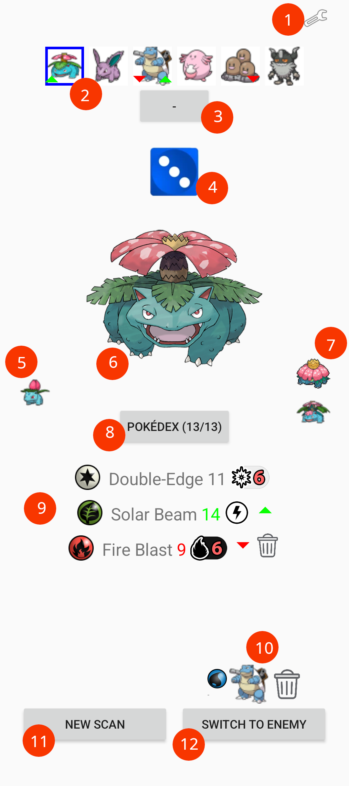 
1. Settings Menu: change language, manage teams, start server for connecting with other devices 
2. Your current team: 
  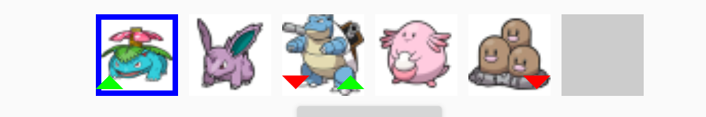 
    - current selected Pokémon is surrounded by a blue rectangle 
    - a green arrow on the left side of its sprite: it has an effective attack vs the enemy 
    - a red arrow on the left side of its sprite: it has only ineffective attacks vs the enemy 
    - a green arrow on the right side of its sprite: enemy has an effective attack vs this Pokémon 
    - a red arrow on the right side of its sprite: enemy has only ineffective attacks vs this Pokémon 
3. +/- button: add the current Pokémon to your team. After clicking the "+" button, select an place to add it. If the current Pokémon is part of the team, remove it with the "-" button. 
4. additional level dice: tap on it to select the current additional level of the current Pokémon 
5. Pokémon that envolves into your current Pokémon. 
6. the current selected/scanned Pokemon 
7. evolution(s) of your current Pokémon. 
8. Press on the Pokédex button to read out the Pokemon name and on of its Pokédex entries. (Because its cool to learn something about the Pokémon) 
9. Moves and attached Items of the current Pokémon: 
    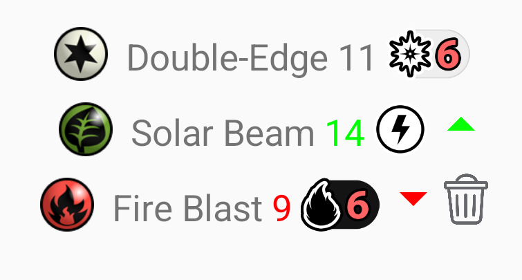 
    from left to right: 
     - Type of the Attack 
     - Name of the Attack 
     - Attack value of the Pokemon, includs: base level, additional level (given by the level dice above), effectiveness, attached items, status conditions, weather effects... A green/red number indicates, that the move is effective/ineffective against the selected enemy. (Tap moves with a * to show explanation)  
     - possible attack effects (tap to show an explanation of the effect) 
     - green/red arrow: additional indicator for type effectiveness (arrows for red/green weakness) 
     - trash sign allows you to remove Items, (z) Moves etc 
10. current enemy Pokémon (a press on the trash sign will remove the enemy Pokémon) 
11. Button to scan QR codes of the Cards (Pokemon, Items, ...) or the QR code to connect to other device. Items will automatically attacked to the current active Pokémon. 
12. Botton to switch the current Pokemon and the current Enemy 

## Settings: 
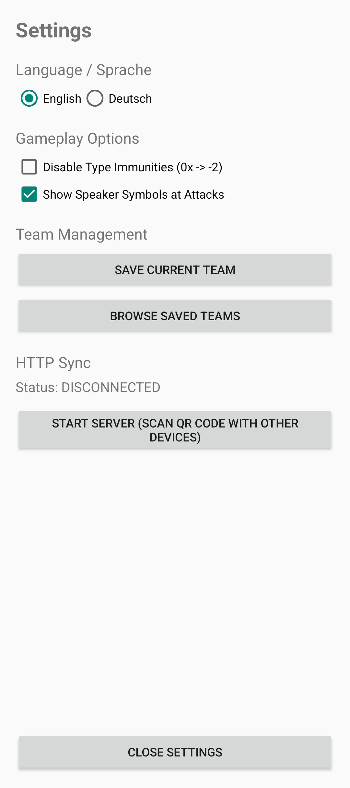 
After pressing the settings button, you are able to: 
- change the language 
- disable type immunities 
- add speaker symbols next to the moves, to read out the names of the moves. (My son is 5 and cant read ;) ) 
- manage your team 
- start a Server: a QR code is displayed, that other devices with the app can scan. It will allow to synconize between your current end the others enemy and vice versa: 
   
  the Squirtle was only scanned with the upper device, the Chamander only scanned, with the lower device. but you can see the card that was not scanned as the enemy. (Note: I created Cards instead of Tokens, because i find them practical. But in the QR-files-folder you will find the backs of the token with QR codes) 

## Examples: 
Scanning a trainer card will show the Pokémon with its attacks. 
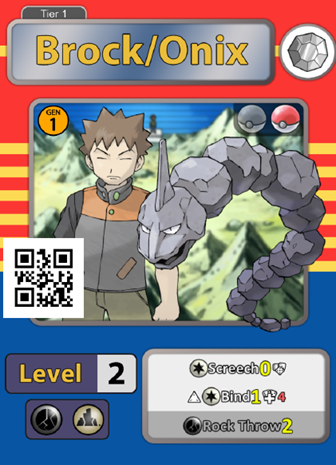 &rarr; 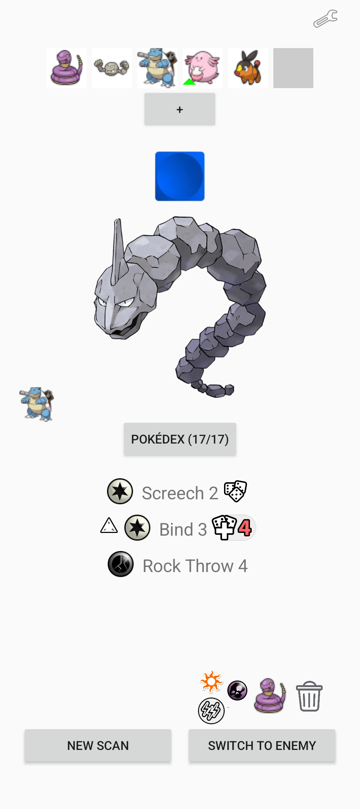  
Scanning a Dynaband will show the Gigamax (if the Pokémon can envolve into one) and/or a Dynamax ball. Pressing on the Gigamax symbol will automatically load the Gigamax version and (and copy stuff like additional levels, attached items, etc). 
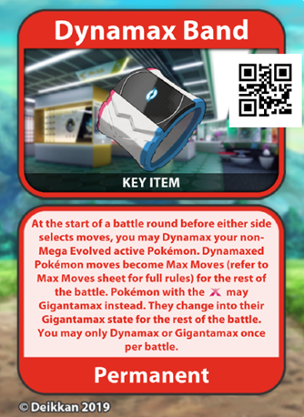 &rarr; 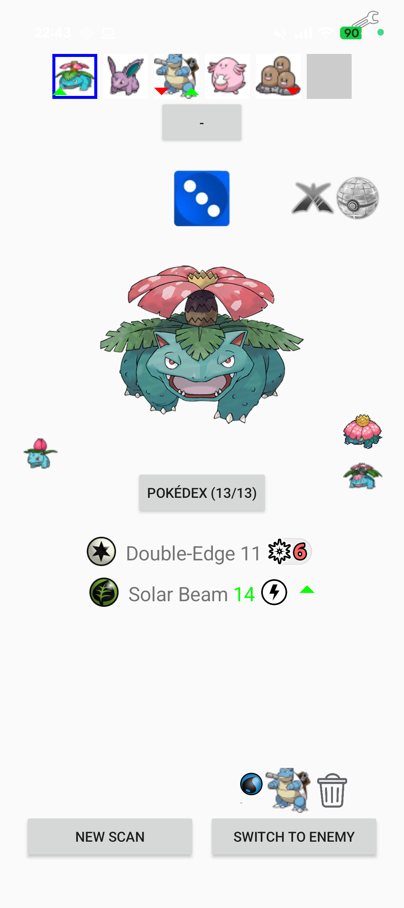 &rarr; 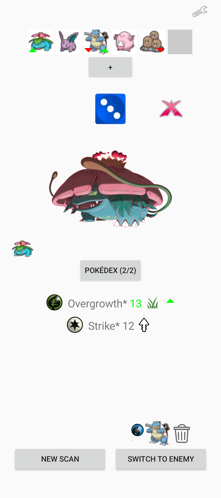  
Scanning status effects or weather conditions, will show the status + weather next to the "Pokédex" button. Both pictures are tapable to show its effect.  
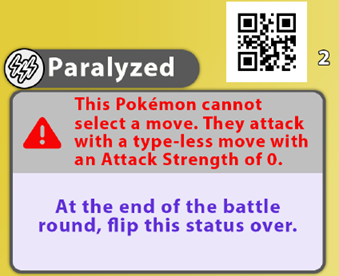 + 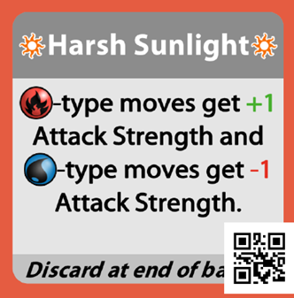 &rarr; 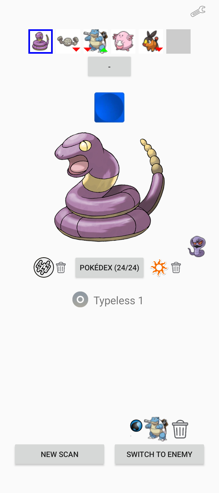  
You can also tap on special moves or additional effects: 
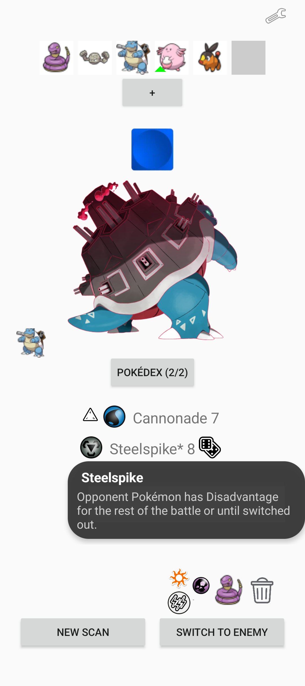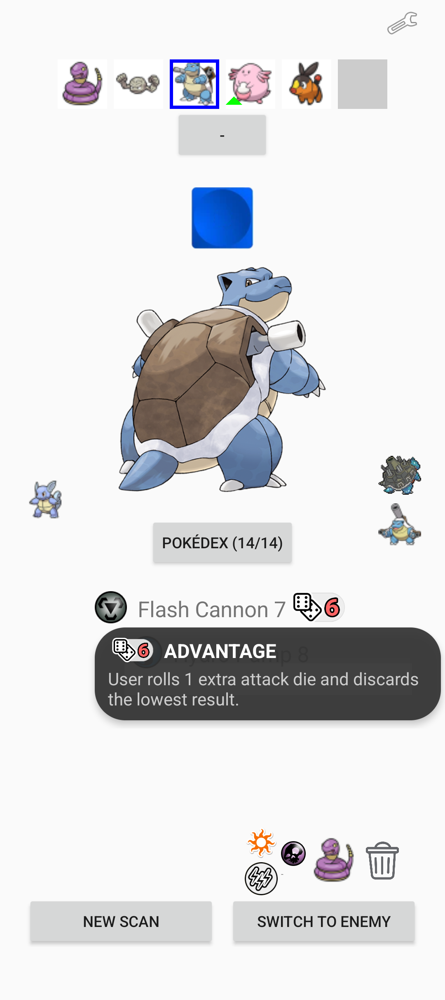  
Scanning a TM will lead to an additional move: 
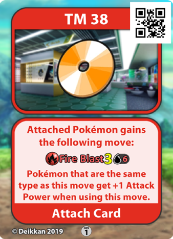 &rarr; 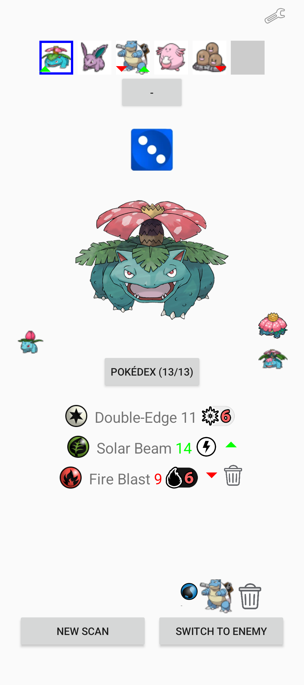  
Items will also show on the slot. Sometimes they provide an permanent effect: 
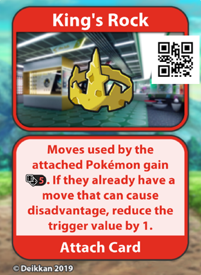 &rarr; 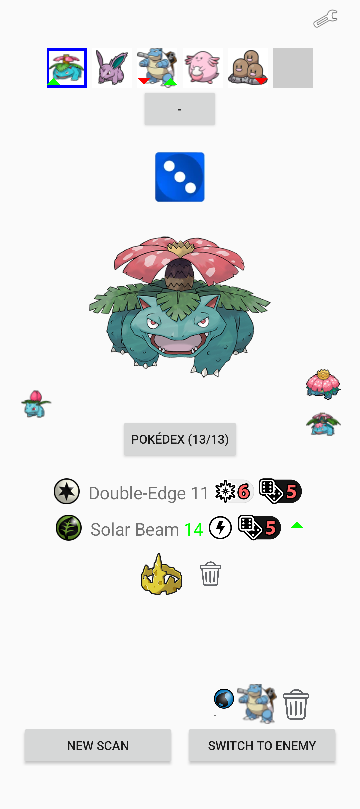  
Sometimes items needs to be activated after scanning: 
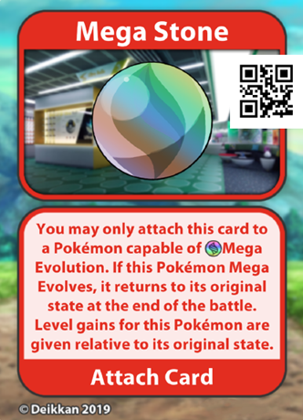 &rarr; 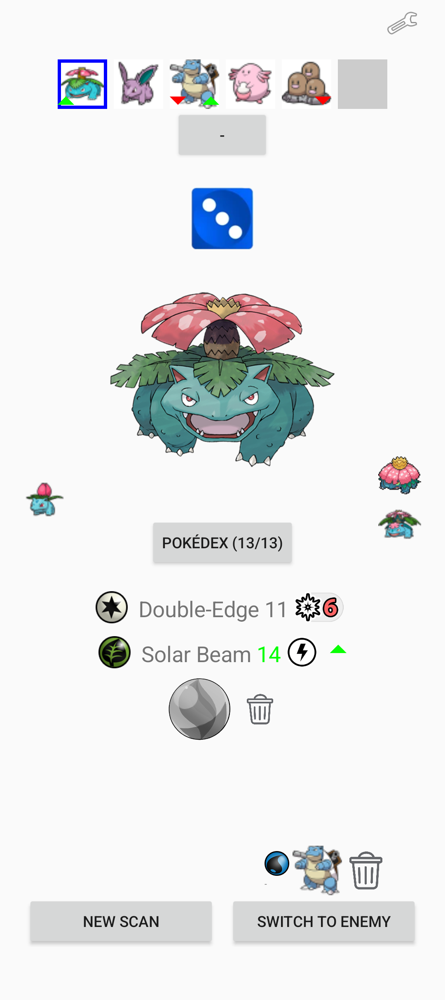  

 
 
 
 
